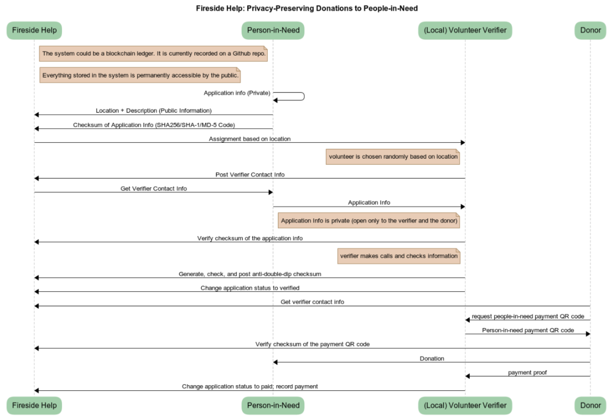

## 围炉送温暖 Fireside Help (Donations to People-in-Need)

## Application and Donation Process

### 历史账本 Transaction History (April 2020, following the current [protocol](Donations/Donations.docx))

| Initiator (Applicant or Donor)   发起人（申请人或捐助人）   | 地区 Location    | 情况描述 Description  | 志愿验证人/协调人联系方式 Volunteer Verifier/Coordinator Contact | 验证结果 Verification results |捐助状态 Status of donation |防重码 Anti-Double-Dip Checksum |
| ------------------- |  ------------------- | ------------------- | ------------------- | ------------------- | ----- | 
| [003-2020.4.6](Donations/003/Donor003) Donor | Ohio | I sold 14 cakes for $10 each. I’d like to donate this $140 to a middle school student in need in Wuhan, China. | [WeChat](Donations/003/Verifier003.png)| 核实无误，验证通过 (2020.4.10) | | 
| [004-2020.4.6](Donations/004/Applicant004) Applicant | Ohio | 一位以前来过本校的访问学者和国内一个厂家捐赠给我们大约10,000个医用外科口罩。现在需要筹集运费7000元人民币把这批口罩运到美国。收款人是本校一位教师，也是为大家服务的。 | [WeChat](Donations/004/Verifier004.png) | | 

### 历史账本 Transaction History (March 2020, following [protocol v0.3](Donations/Donations-v0.3.docx))

|实需生 Student in need           | 地区 Location    | 受疫情影响(可选） Description (optional)  | 志愿验证人联系方式 Volunteer Verifier Contact | 验证结果 Verification results |捐助状态 Status of donation |防重码 Anti-Double-Dip Checksum |
| ------------------- |  ------------------- | ------------------- | ------------------- | ------------------- | ----- | 
| [001-2020.3.14](Donations/001/Student001)  | 湖北武汉 Wuhan            |  父亲病逝由母亲抚养，母亲务农，家庭经济困难。  Single-parent. Mom works in a farm.            |[WeChat](Donations/001/Verifier001.jpg) | 已验证，可信 Verified（2020.3.14）|围炉800元+prana 200元=共 1000元 A total of RMB 1000 Donated by two donors (2020.3.14)|9377BD31C6D279BE299BC87F6BCA5C17 (MD5)|
| [002-2020.3.18](Donations/002/Student002) | 湖北武汉 Wuhan | 我们在武汉一高校内经营着一家洗车店。由于疫情无法营业，两三个月家庭没有收入。希望疫情早点结束！Parents run a small car-wash shop in a college. No income in the past two months. | [WeChat](Donations/002/Verifier002.jpg)| 符合受助条件，可信。Verified (2020.3.20)|匿名 1000元 RMB1000 Donated (2020.3.19) |FE63CA8B8CB343FBAF3576E9DC053703FA75CAE4 (SHA1) |

