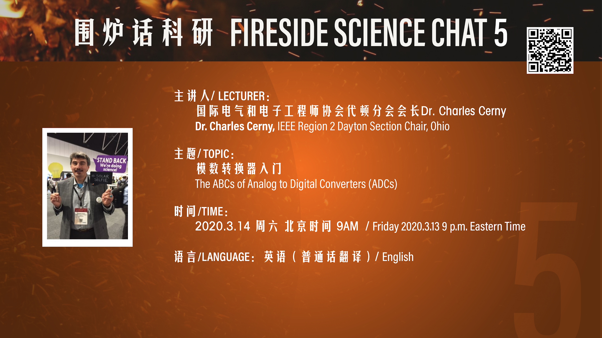
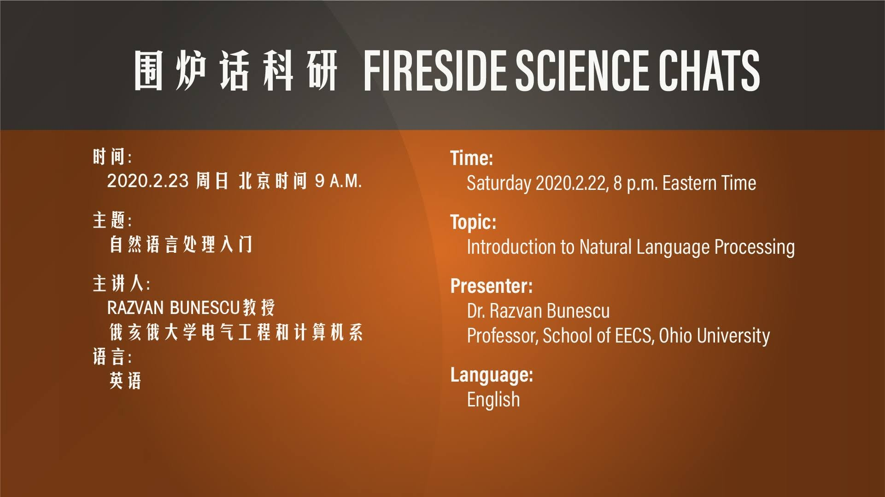
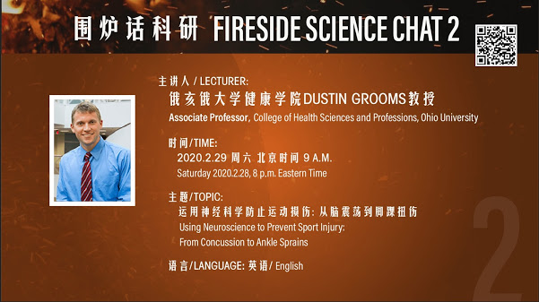
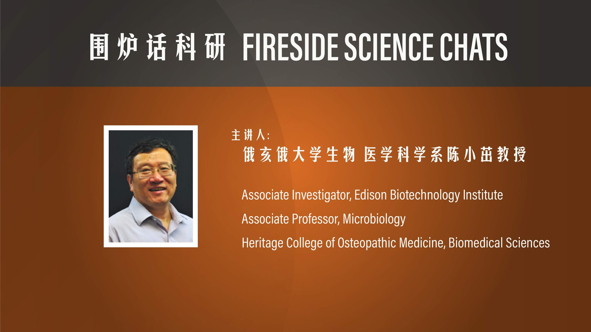
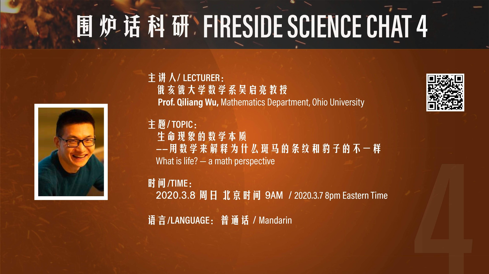

##  【围炉话科研】 Fireside Science Chat

2020年1月23日早上十点，武汉封城。

千万人口的大都市因为新型冠状病毒而完全封闭，史无前例。

到二月下旬，在武汉和中国许多城市，很多小孩都已经居家禁足快一个月了。为帮助中学生缓解疫情中的紧张情绪，同时了解前沿课题，培养科研兴趣，IEEE 第二区、俄亥俄大学和其他一些志愿者开办了一个免费远程讲座系列【围炉话科研】(Fireside Science Chat)。Fireside Science Chat 中的Fire源于火神山的火字。

IEEE(国际电气和电子工程师协会）总部在美国，共分十个区，其中六个在美国。第二区主要是美东几个州，包括俄亥俄州，都在美东时区。

On 23 January 2020, a lockdown was imposed in Wuhan, China to quarantine the epicenter of the outbreak of coronavirus disease 2019 (COVID-19). A lockdown of a metropolitan area with a population of over 10 million had never happened before in the human history.

To help relieve the stress of being confined at home for nearly a month, volunteers from IEEE Region 2 and Ohio University and others offered a series of online "Fireside Science Chats" to middle and high school students in locked-down Chinese cities.

### NEW 【围炉话科研】第五炉：模数转换器入门
时间：2020.3.14 周六 北京时间 9AM
主讲人：国际电气和电子工程师协会代顿分会会长Dr. Charles Cerny
语言：英语（普通话翻译）

Time: Friday 2020.3.13 9pm Eastern Daylight Time
Topic: The ABCs of Analog to Digital Converters (ADCs)
Presenter: Dr. Charles Cerny, IEEE Region 2 Dayton Section Chair, Ohio
Language: English

## Past Presentations

### 第一炉 Chat No. 1：自然语言处理入门 by Dr. Razvan Bunescu

Youtube: [https://youtu.be/YpHxNCfnSJU](https://youtu.be/YpHxNCfnSJU)

Bilibili: [https://www.bilibili.com/video/av91262682/](https://www.bilibili.com/video/av91262682/)

- 主题: 自然语言处理入门
- 主讲人：俄亥俄大学电气工程和计算机系教授Razvan Bunescu
- 时间：2020.2.23 周日 北京时间 9AM 
- 语言：英语

- Title: Introduction to Natural Language Processing
- Presenter: Dr. Razvan Bunescu, Professor, School of EECS, Ohio University
- Time: Saturday 2020.2.22 8pm Eastern Time
- Language: English

### 第二炉 Chat No. 2：Using Neuroscience to Prevent Sport Injury: From Concussion to Ankle Sprains, by Dr. Dustin Blooms

Youtube: [https://youtu.be/YsAE3ea7di4](https://youtu.be/YsAE3ea7di4)

Bilibili: [https://www.bilibili.com/video/av92996460/](https://www.bilibili.com/video/av92996460/)

- 主题: 运用神经科学防止运动损伤：从脑震荡到脚踝扭伤
- 主讲人：俄亥俄大学健康学院Dustin Blooms教授
- 时间：2020.2.29 周六 北京时间 9AM 
- 语言：英语

- Topic: Using Neuroscience to Prevent Sport Injury: From Concussion to Ankle Sprains
- Presenter: Prof. Dustin Blooms, College of Health Sciences and Professions, Ohio University
- Time: Friday 2020.2.28 8pm Eastern Time
- Language: English

### 第三炉 Chat No. 3：历史上改变中国和世界的瘟疫和战胜瘟疫的故事 - 从水浒传到牛顿 : 生物医学科学简介 by Dr. 陈小茁

YouTube: [https://youtu.be/x_8qdEcQiXI](https://youtu.be/x_8qdEcQiXI)

Bilibili: [https://www.bilibili.com/video/av93263129/](https://www.bilibili.com/video/av93263129/)

- 主题: 历史上改变中国和世界的瘟疫和战胜瘟疫的故事 - 从水浒传到牛顿 : 生物医学科学简介
- 主讲人：俄亥俄大学生物医学科学系陈小茁教授
- 时间：2020.3.1 周日 北京时间 9AM 
- 语言：普通话

- Topic: Brief Introduction to biomedical sciences:  stories in the history about plagues and disease-conquering in China and other countries that changed the world – from “Outlaws of the Marsh” to Newton
- Presenter: Prof. Xiaozhuo Chen, Biomedical Sciences, Ohio University
- Time: Saturday 2020.2.29 8pm Eastern Time
- Language: Chinese (Mandarin)

### 第四炉 Chat No. 4：生命现象的数学本质--用数学来解释为什么斑马的条纹和豹子的不一样

YouTube: [https://youtu.be/KhNJRyVrGkQ](https://youtu.be/KhNJRyVrGkQ)

Bilibili: [https://www.bilibili.com/video/av94706218/](https://www.bilibili.com/video/av94706218/)

时间：2020.3.8 周日 北京时间 9AM
主讲人：俄亥俄大学数学系吴启亮教授
语言：普通话

Time: Saturday 2020.3.7 8pm Eastern Time
Topic: What is life? -- a math perspective
Presenter: Prof. Qiliang Wu, Mathematics Department, Ohio University
Language: Chinese (Mandarin)
